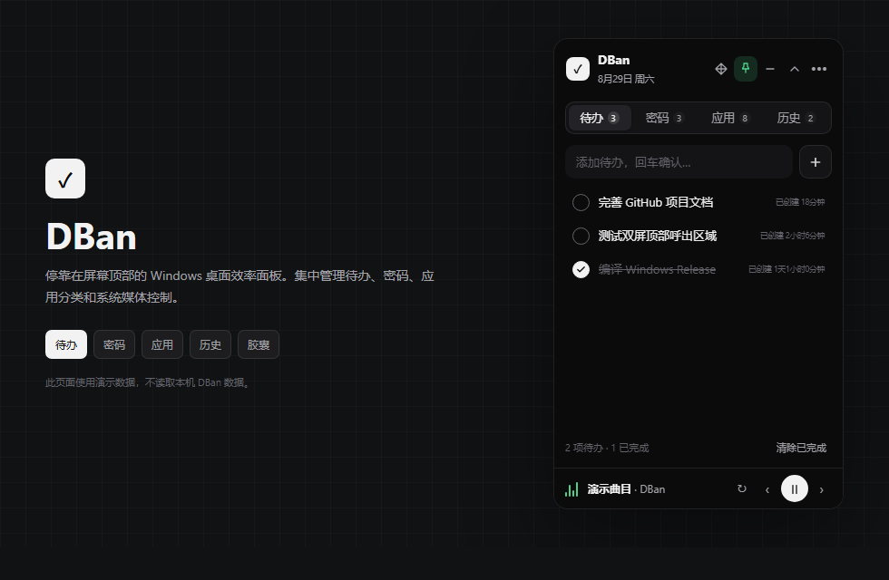
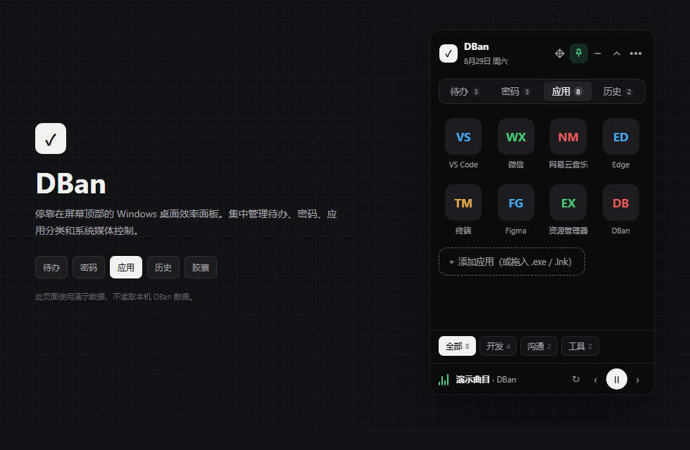
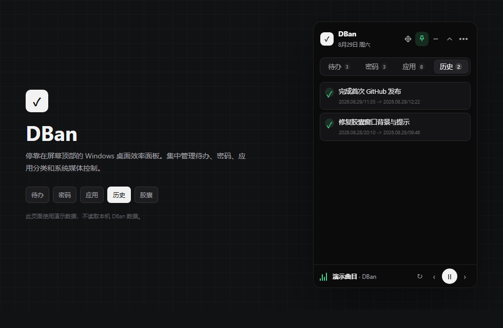
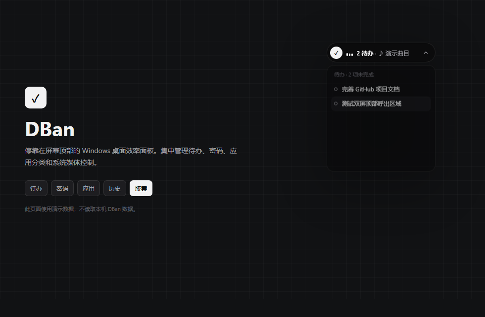

# DBan

DBan 是一款面向 Windows 的桌面效率工具，将待办事项、密码管理、应用快捷启动和系统媒体控制集中在一个可停靠于屏幕顶部的小型面板中。

项目使用 Vue 3、TypeScript、Tauri 2 和 Rust 开发。应用默认驻留系统托盘，支持顶部识别区域呼出、全局快捷键和紧凑胶囊模式。

## 界面预览

<p align="center">
  
  
</p>

<p align="center">
  
  
</p>

图片使用演示数据生成，不包含真实待办、账户或本机应用路径。也可以下载仓库后直接打开 [`docs/showcase.html`](docs/showcase.html)，切换查看待办、密码、应用、历史和胶囊模式。

## 功能

- 待办管理：创建、编辑、完成、删除和清除待办，显示待办已创建时长。
- 待办历史：清除已完成项时保存创建时间和清除时间。
- 密码管理：密码正文保存在 Windows 凭据管理器中，界面数据不保存明文密码。
- 应用启动器：拖入 `.exe` 或 `.lnk`，支持分类、分类记忆、重命名和移动。
- 媒体控制：读取 Windows 系统媒体会话，支持播放、暂停、上一首、下一首、播放模式切换，以及仅捕获指定播放器。
- 胶囊模式：显示待办数量和当前媒体信息，可通过箭头展开未完成待办。
- 窗口停靠：窗口只能沿屏幕顶部移动，支持多显示器、不同 DPI 和左右边缘吸附。
- 顶部呼出：停留后先露出带小白条的 `16px` 面板底边，点击后展开完整面板；可设置识别区域宽度和停留时间。
- 系统集成：支持托盘、开机自启动、窗口置顶及全局快捷键 `Alt + D`。
- 外观：支持深色和浅色主题。

## 系统要求

当前实现面向 Windows 10/11，部分能力依赖 Windows API：

- Windows Credential Manager
- Global System Media Transport Controls
- Windows 托盘、光标和显示器 API
- Microsoft Edge WebView2 Runtime

因此项目目前不能直接构建为功能等价的 macOS 或 Linux 版本。

## 开发环境

开始前安装：

- Node.js 20 或更高版本
- pnpm 9 或更高版本
- Rust stable 工具链
- Visual Studio 2022 Build Tools，包含“使用 C++ 的桌面开发”
- WebView2 Runtime

克隆并安装依赖：

```powershell
git clone https://github.com/huihuilikaile/DBan.git
cd DBan
pnpm install
```

启动开发模式：

```powershell
pnpm tauri dev
```

仅构建前端：

```powershell
pnpm build
```

运行 Rust 测试：

```powershell
cargo test --manifest-path src-tauri/Cargo.toml
```

## 构建

构建不带安装器的 Release 可执行文件：

```powershell
pnpm tauri build --no-bundle
```

输出位置：

```text
src-tauri/target/release/dban.exe
```

构建 NSIS 安装包：

```powershell
pnpm tauri build
```

Release 构建使用 Windows GUI 子系统，正常启动时不会显示 CMD 控制台窗口。

## 数据与安全

- 待办、历史、应用分类、媒体捕获范围和界面设置由 Tauri Store 保存到应用数据目录的 `dban.json`。
- 窗口在各显示器上的停靠位置保存到 `window-placement.json`。
- 密码正文使用 Windows 凭据管理器保存，不写入 `dban.json`。
- 仓库不包含用户数据、密码、构建产物或本地开发会话文件。

在公开问题或日志前，请检查内容中是否包含本地应用路径、账户名称或其他个人信息。

## 使用说明

- 将鼠标停留在窗口记忆位置对应的屏幕顶部区域，会露出面板底边；点击露出区域后展开主面板。
- 使用标题栏四向箭头按钮沿屏幕顶部移动窗口。
- 将窗口极致靠近屏幕左侧或右侧可自动吸附。
- 使用 `Alt + D` 呼出或隐藏面板，可在设置中关闭该快捷键。
- 在设置的“媒体捕获”中选择“指定”，可勾选网易云音乐、汽水音乐等 Windows 当前发现的播放器；点击刷新按钮可重新扫描。
- 浏览器媒体会话只能按 Chrome、Edge、Firefox 等浏览器应用筛选，Windows 不提供可靠的网页站点级来源标识。
- 点击收起按钮进入胶囊模式，点击胶囊主体返回主面板。
- 胶囊右侧箭头用于展开或隐藏未完成待办。
- 将 `.exe` 或 `.lnk` 文件拖到应用页可添加快捷启动项。
- 在应用内容区右键可新建分类，在应用上右键可移动分类。

## 项目结构

```text
src/                    Vue 前端界面和状态管理
src/components/         面板、待办、密码、应用和播放器组件
src-tauri/src/          Tauri 命令及 Windows 原生功能
src-tauri/capabilities/ Tauri 权限配置
src-tauri/icons/        应用图标
scripts/                图标和本地测试脚本
design/                 早期界面设计稿
docs/                   开发与架构文档
```

更详细的实现说明见 [开发文档](docs/DEVELOPMENT.md)。

## 当前状态

项目仍处于早期开发阶段，配置格式和功能行为可能继续调整。提交 Issue 时请附上 Windows 版本、显示器缩放比例、复现步骤和相关错误信息。
